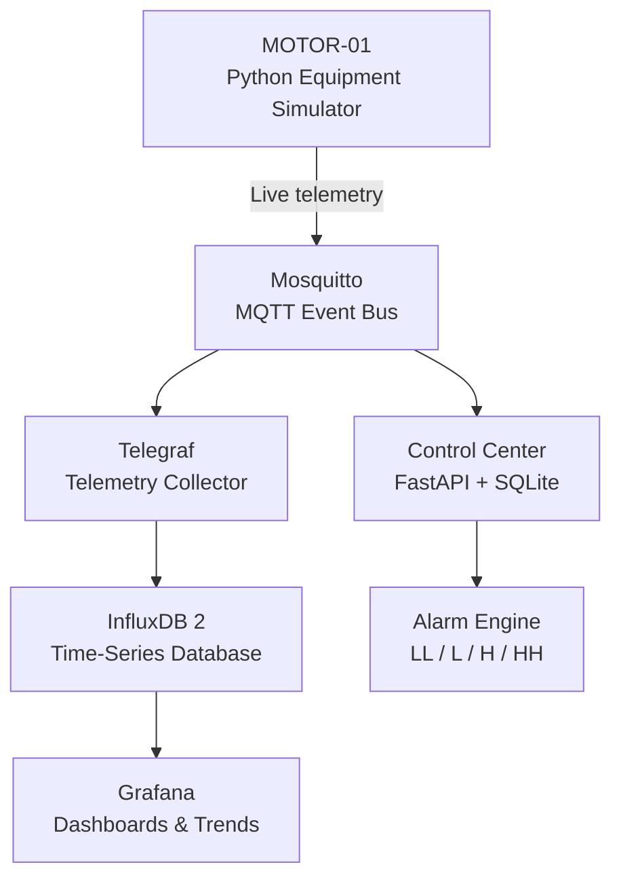

# Virtual Data Center Lab — V1

A hands-on home lab for practicing **data center monitoring, critical-facilities telemetry, BMS concepts, alarms, and troubleshooting**.

I built this project to move beyond reading about critical infrastructure and create a small environment where I can generate equipment telemetry, monitor operating conditions, configure alarm thresholds, inject faults, and observe system behavior.

> **Status:** Version 1 — active learning project. This is a simulated lab, not a production data center.

## Architecture



### Live V1 data paths

```text
MOTOR-01 → MQTT → Telegraf → InfluxDB → Grafana
              └→ Control Center → Alarm Engine
```

## What V1 Does

The live `MOTOR-01` simulator publishes motor/VFD telemetry every few seconds:

- Motor temperature
- Current
- Speed / RPM
- Vibration
- Motor voltage
- VFD frequency
- Bearing temperature
- Winding temperature
- Power

The Control Center provides an equipment/BMS registry where analog, binary, and multistate points can be configured. Analog points support configurable **Low-Low, Low, Normal, High, and High-High** values.

The alarm engine evaluates live analog telemetry against those configured limits and reports **NORMAL, WARNING, or CRITICAL** conditions.

## Fault-Injection Scenarios

The simulator currently supports:

- `NORMAL`
- `OVERHEAT`
- `OVERCURRENT`
- `UNDERVOLTAGE`
- `BEARING_FAULT`
- `VIBRATION`
- `STOPPED`

For example, an `OVERHEAT` test can raise correlated motor measurements until the configured warning and critical thresholds are crossed. Returning the simulator to `NORMAL` clears the condition as the system recovers.

## Tools

| Tool | Purpose in this lab |
| --- | --- |
| Python | Simulates equipment behavior and telemetry |
| Docker / Docker Compose | Runs the lab services as containers |
| Mosquitto / MQTT | Carries live equipment telemetry and simulator commands |
| Telegraf | Collects MQTT telemetry |
| InfluxDB 2 | Stores time-series telemetry |
| Grafana | Displays live values and historical trends |
| FastAPI | Provides the Control Center/API |
| SQLite / SQLAlchemy | Stores equipment, BMS points, and configured thresholds |

## Hardware Used

This V1 lab was developed on:

- MacBook Pro
- Intel Core i9, 8-core, 2.4 GHz
- 32 GB RAM
- Docker Desktop

No physical data-center equipment is required for the current simulated version.

## Quick Start

### 1. Clone

```bash
git clone https://github.com/guivelynoel/Guively-datacenter-Lab.git
cd Guively-datacenter-Lab
```

### 2. Configure environment

The project intentionally excludes local secrets and runtime database files from Git.

Create your local `.env` using the environment variables required by the Compose configuration. Do not commit credentials or tokens.

### 3. Start the stack

```bash
docker compose up -d --build
docker compose ps
```

### 4. Open the interfaces

- Control Center: `http://localhost:8000`
- Grafana: `http://localhost:3000`
- InfluxDB: `http://localhost:8086`
- MQTT: port `1883`

### 5. Watch MOTOR-01

```bash
docker compose logs -f motor-simulator
```

### 6. Inject an OVERHEAT condition

```bash
docker run --rm --network vdc-lab-network eclipse-mosquitto:2 \
  mosquitto_pub -h vdc-mqtt \
  -t 'dc1/mechanical/motor/MOTOR-01/command' \
  -m 'OVERHEAT'
```

Watch the telemetry and alarm state change in the Control Center/Grafana.

### 7. Recover

```bash
docker run --rm --network vdc-lab-network eclipse-mosquitto:2 \
  mosquitto_pub -h vdc-mqtt \
  -t 'dc1/mechanical/motor/MOTOR-01/command' \
  -m 'NORMAL'
```

## Configured vs. Live

It is important to distinguish between implemented telemetry and the roadmap.

**Live in V1**
- MOTOR-01 MQTT telemetry
- Mosquitto event bus
- Telegraf collection
- InfluxDB storage
- Grafana visualization
- FastAPI/SQLite Control Center
- Analog threshold alarm evaluation
- Controlled motor fault injection

**Configured but not yet live**
- PUMP-01 is registered as a Modbus TCP asset, but live Modbus telemetry is not implemented yet.

**Planned**
- Modbus TCP simulation
- BACnet/IP
- Additional pumps and cooling equipment
- UPS / power equipment
- Zabbix alarm integration
- Digital and multistate alarm logic
- Browser-based fault-injection controls
- Additional troubleshooting scenarios

## Why I Built It

My goal is to develop practical skills around the systems used to operate and troubleshoot critical environments: telemetry, electrical/mechanical equipment monitoring, BMS concepts, alarms, procedures, trend analysis, and infrastructure reliability.

This repository documents that learning process one version at a time.

## Disclaimer

This project is an educational simulation. Values, equipment behavior, thresholds, and fault scenarios are designed for lab practice and should not be treated as engineering specifications or operating limits for real equipment.
